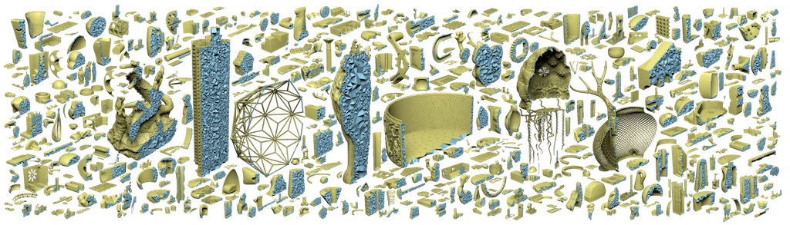
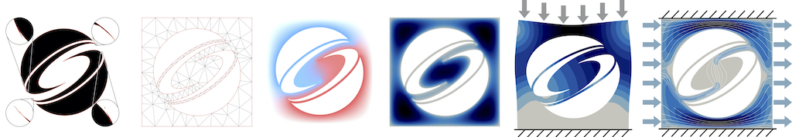

Wildmeshing
===========
*a simple and robust 2d and 3d meshing package*

Check [TetWild](tetwild.md) and [fTetwild](ftetwild.md) for our open-source C++ robust tet-mesher.

Check [TriWild](triwild.md) for our C++ curved tri-mesher.

If you just want to run it, checkout our [python bindings](python.md)! 
They provide a precompiled binary downloadable trough [conda forge](https://anaconda.org/conda-forge/wildmeshing) with an easy-to-use python interface.
